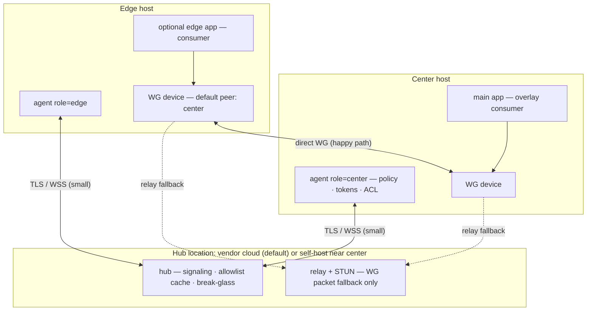

# Architecture

svc-peer is a multi-tenant WireGuard overlay written in Go. Per `hub_id` there is exactly one **center** agent and many **edge** agents. Application traffic prefers **direct WireGuard edge↔center**. When a vendor cloud is used, it is a **NAT bridge** only (STUN, relay, thin signaling) — not the business control plane, not the preferred dataplane, and not an SFU.

Greenfield implementation inspired by Headscale / Netbird / Tailscale; not a fork.

## Binaries and process boundaries

| Binary | Role |
|--------|------|
| `cmd/hub` | Thin signaling / NAT assist; allowlist cache; break-glass ops |
| `cmd/relay` | DERP-like forwarder of opaque encrypted WireGuard packets (fallback only) |
| `cmd/agent` | Overlay agent; `role=center` or `role=edge` |

| Term | Definition |
|------|------------|
| **Center** | Agent with `role=center`. Network authority: tokens, allowlist, ACL, grants, membership (via hub APIs / agent config). |
| **Main app** | Business application that consumes the overlay (overlay IP / MagicDNS). Separate process from the center agent, even when colocated on the same host. |
| **Edge** | Agent with `role=edge`. Optional edge apps are overlay consumers only. |
| **Network management** | Tokens, allowlist, ACL, grants, membership — in hub and/or center agent only, never in the main business app. |

**Invariant:** hub process ≠ center-agent process ≠ main-app process. The hub is never embedded in the business app.

## Deploy modes

| Mode | Hub + relay | Center agent | App dataplane |
|------|-------------|--------------|---------------|
| **Vendor cloud (default)** | Vendor cloud (thin hub + STUN + relay) | Client host, colocated with main app (separate process) | Direct WG edge↔center; cloud not preferred next-hop |
| **Self-host** | Client site, near/with center | Client host (still separate from main app) | Same ACL; no vendor in path |

Cloud provides STUN, encrypted-WG relay fallback, thin signaling for NATed enrollment / peer exchange, and an allowlist cache synced from center. It does **not** provide day-to-day edge token mint UI, preferred app dataplane, policy/ACL/membership authority, or SFU/media decode.

Connectivity shape matches classic WebRTC (signaling + STUN + P2P + TURN/relay) with a WireGuard dataplane. Apps (RTSP/SRT/HTTP/TCP/UDP) run as normal IP traffic over the overlay. There is no custom streaming stack on WireGuard.

## Topology

| Plane | Path |
|-------|------|
| Signaling / NAT assist | Hub (vendor cloud or self-host) |
| Network control | Center agent (authoritative); thin hub validates/caches |
| Dataplane happy path | Direct WG edge↔center |
| Dataplane fallback | Encrypted WG via owned relay when direct/punch fails |

## ACL and netmap

Per `hub_id`:

| Direction | Default |
|-----------|---------|
| Edge → Center | Allow (direct WG) |
| Center → Edge | Allow (direct WG) |
| Edge → Edge | Deny (no peer; no hub hairpin) |
| Hub as app next-hop | Not default |
| Extra A2A | Center-authored grant (`/local/grants` → hub `/hub/grants`) → direct WG peers only |

Exactly one center per `hub_id`. The hub rejects a second center claim. A hub WireGuard identity may exist for ops; it must not be the default edge↔center app path.

Netmap rules:

1. Netmap advertises `center` (`center_agent_id` and/or `role` on peer entries).
2. Default edge peers = `[center]` only.
3. Default center peers = all edges on that hub.
4. Denied pairs: no peer, no AllowedIPs, no A→hub→B hairpin.
5. Grant/revoke rebuilds peers on the next netmap revision. Center persists grants in `{state_dir}/grants.json` and syncs to the hub with `center_bootstrap` (same auth pattern as allowlist sync). Punch and relay tickets are issued only for allowed pairs (edge↔center or an active grant).
6. MagicDNS name→IP may list agents without granting dataplane permission.

## Identity and bootstrap

Fully token-based. No separate `hub_secret`.

| Credential | Purpose |
|------------|---------|
| **`center_bootstrap`** | Shared secret in hub config + center agent config. Center **first register only** — claims sole `center` for `hub_id`. Not for edges; not day-to-day mint. |
| **Center agent** | After bootstrap: owns policy, join tokens, ACL, membership. Creates edge tokens; syncs allowlist to hub while online. |
| **Join / agent token** | Edge enroll, heartbeat, receive netmap. Cannot request/grant/revoke peers. Configured on center; synced to hub allowlist (`PUT /hub/allowlist`). |
| **Management token** | Hub ops / revoke break-glass. Not primary mint UX; not primary ACL editor. Optional seed separate from `center_bootstrap`. |

Agent ID:

- Generated locally on first agent run (UUID or derive from WG pubkey).
- Persisted in the agent state directory.
- Presented at register; hub does not assign IDs.
- Hub rejects collision when `agent_id` is already bound to a different token/identity on that `hub_id`.
- Reconnect / token rotate keeps the same Agent ID unless local state is wiped.

Join flow:

1. Hub and center share `center_bootstrap`.
2. Center first run: generate `agent_id` + WG keys → register with bootstrap → sole center.
3. Operators create edge join tokens on the center (local API `/local/allowlist` and/or YAML `edge_tokens` seed); durable store is `{state_dir}/allowlist.json`. Center syncs the allowlist to the hub.
4. Edge first run: generate `agent_id` → enroll with join token (via center path or hub passthrough when NATed).
5. Netmap: edges peer center; center peers edges.
6. Direct WG; relay only if P2P/punch fails.

Tokens and Agent IDs are scoped to one `hub_id`. No cross-hub overlay.

## NAT traversal / path selection

Attempt order for an allowed peer (primarily edge↔center; also granted A2A):

1. **Direct underlay / private host** — agents advertise host-local interface addresses (RFC1918, link-local, ULA, CGNAT). When center and edge are L3-reachable on the underlay, WireGuard uses these private endpoints first. Hub is not in the dataplane path.
2. Last known direct WG endpoint (if still valid).
3. Exchange STUN reflexive candidates via hub control channel; coordinated UDP hole punch, then WG handshake.
4. Relay fallback (UDP or WS/TLS) if handshake/keepalive fails.

Candidate ranking: private/underlay `host` → other `host` → `srflx`. Keepalive (e.g. WG PersistentKeepalive ~25s) maintains NAT bindings. Endpoint updates are control messages — not a full ICE stack. In vendor-cloud mode, vendor dataplane involvement is **relay fallback only**.

## Overlay addressing

| Topic | Decision |
|-------|----------|
| Overlay CIDR | Configurable per hub via config file |
| Naming | MagicDNS + overlay IP |
| Resolve | Inside the agent from hub-pushed netmap |
| Deferred | Dedicated DNS on overlay IP; OS-wide DNS hijack |

## Component responsibilities

### Hub

Validate `center_bootstrap` (sole center claim); validate join tokens against center-synced allowlist; Agent ID uniqueness; management-token break-glass. Cache hub_id, Agent ID, role, presence, keys, overlay IPs, MagicDNS, endpoints — membership/policy source of truth remains the center. Apply center-authored ACL; IPAM from config-file overlay CIDR. HTTP/WS for enroll, presence, allowlist ingest, heartbeat, endpoint reports, punch, peer config push.

### Agent

Local Agent ID generation + persistence; hub client (register, WS control, apply netmap); WireGuard device (prefer kernel WG via `wgctrl` / netlink; fall back to `wireguard-go`); STUN / hole punch / relay client; agent-local MagicDNS from netmap. Center-only: durable join-token store (`internal/agent/allowlist`) and A2A grant store (`internal/agent/grants`); create/revoke via `/local/allowlist` and `/local/grants`; sync both to the hub. Local HTTP (`/local/*`) also covers peers, status, TX/RX from WG device stats — not the hub control plane.

### Relay

Authenticated with short-lived hub-issued tickets. Forwards opaque WG packets; does not terminate WireGuard crypto. MVP transports: UDP and TCP/WS/TLS. Used only for allowed peer pairs when direct/punch fails. Tickets bound to hub and allowed peer pair.

## Performance and non-choices

Maximize dataplane throughput via direct WG edge↔center and kernel WG when available. Minimize resource use with tight peer lists (default edge→center only), signaling-only control plane, and relay only when P2P fails. Scale target: hundreds of agents per hub; many isolated hubs.

Explicit non-choices: WebRTC/pion as primary dataplane; coturn as primary relay; fork of Headscale/Netbird; open edge↔edge mesh by default; agent peers hub only for app data; hairpin for denied pairs; custom media/SFU on WG; network management inside the main business app.

## Related docs

- [Deploy guide](./deploy.md)
- [HTTP API reference](./api.md)
- Root [README](../README.md)
